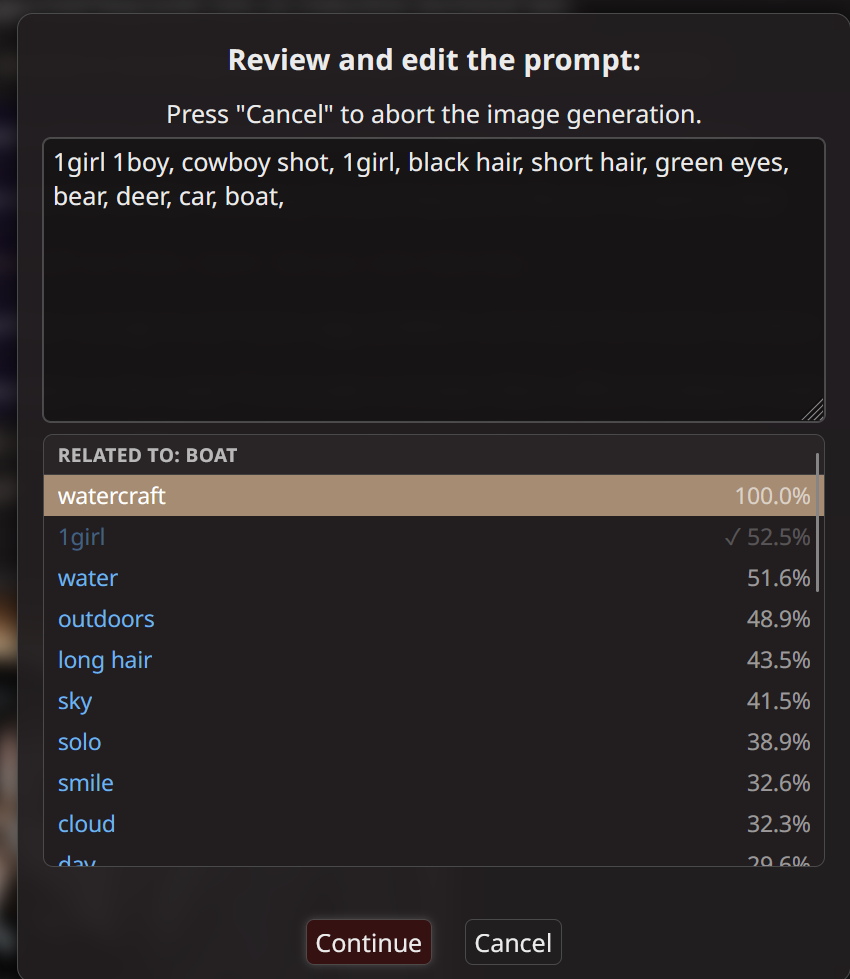

# Tag Autocomplete (Image Prompts) for SillyTavern

Danbooru tag autocomplete for SillyTavern's image generation, in the **"Review and edit the prompt"** popup
and (optionally) the Image Generation prompt prefix / negative fields.
Built for SDXL / Illustrious / NoobAI-style models that understand Danbooru tags.



## Features

- **Autocomplete while typing** – ~32k Danbooru tags, sorted by popularity.
  Matches tag prefixes, aliases (`long hair` → `long_hair`), and optionally words inside tags (`hair` → `black_hair`).
- **Related tags on click** – click a tag that's already in the prompt to see the tags that most often appear
  alongside it on Danbooru, with percentages. Pick one to add it right after the clicked tag.
- **Category colors** – general (blue), character (green), artist (red), copyright (purple), meta (orange).
- **Custom snippets** (gold) – a short trigger word that inserts a whole line, e.g. a character's look plus their LoRA.
- Tags already in the prompt are dimmed with a ✓. Parentheses are escaped automatically (`name \(series\)`).
- Leaves `<lora:...>`, `embedding:...`, `BREAK` and weights like `smile:1.2` alone.

## Install

1. SillyTavern → **Extensions** → **Install extension** → paste:
   `https://github.com/Haek11/SillyTavern-Booru-Autocomplete`
2. **For related tags:** download `related_tags.csv` from the
   [latest Release](https://github.com/Haek11/SillyTavern-Booru-Autocomplete/releases/latest)
   and put it in the extension's folder:
   `SillyTavern/public/scripts/extensions/third-party/SillyTavern-Booru-Autocomplete/`
   (Without it, everything else still works – clicking a tag just won't show related tags.)
3. Reload SillyTavern. There's a short warm-up while the tag lists load on first use.

## Keys

| Key | Action |
|---|---|
| ↑ / ↓ | Move through the list |
| Enter / Tab | Insert the highlighted tag |
| Esc | Close the list (the popup stays open) |
| Mouse click | Insert that tag |
| Click a tag in the prompt | Show related tags |

Ctrl+Enter still submits the popup as usual.

## Settings

Extensions panel → **Tag Autocomplete**:

- Enabled
- Also in Image Generation prefix / negative fields
- Match words inside tags
- Click an existing tag to see related tags
- Max suggestions (5–50) – typing list
- Max related tags (10–100) – related list

## Custom snippets

Copy `custom_tags.example.txt` to `custom_tags.txt` in the extension folder and edit it:

```
trigger | text to insert
mychar  | 1girl, long hair, silver hair, red eyes, black coat
mylora  | <lora:your_lora_file:0.7>, your_trigger_word
```

`custom_tags.txt` isn't tracked by git, so updating the extension won't overwrite it.

## Rebuilding related_tags.csv

`tools/build_related.py` builds it from `danbooru_tags_cooccurrence.csv` in
[newtextdoc1111/danbooru-tag-csv](https://huggingface.co/datasets/newtextdoc1111/danbooru-tag-csv)
(if you use ComfyUI-Autocomplete-Plus you already have it in its `data/` folder):

```
python tools/build_related.py path/to/danbooru_tags_cooccurrence.csv danbooru_tags.csv related_tags.csv 100
```

## Credits

- Tag data: [newtextdoc1111/danbooru-tag-csv](https://huggingface.co/datasets/newtextdoc1111/danbooru-tag-csv) (MIT),
  built from Danbooru metadata. See [THIRD_PARTY_NOTICES.md](THIRD_PARTY_NOTICES.md).
- Inspired by [ComfyUI-Autocomplete-Plus](https://github.com/newtextdoc1111/ComfyUI-Autocomplete-Plus).
- Note: Danbooru's tag set includes NSFW tags.

## License

MIT – see [LICENSE](LICENSE).
